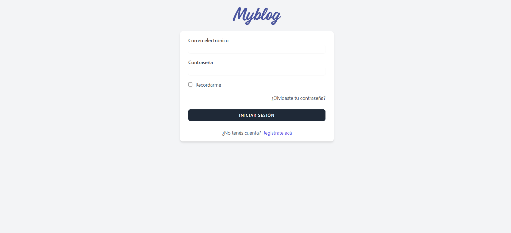
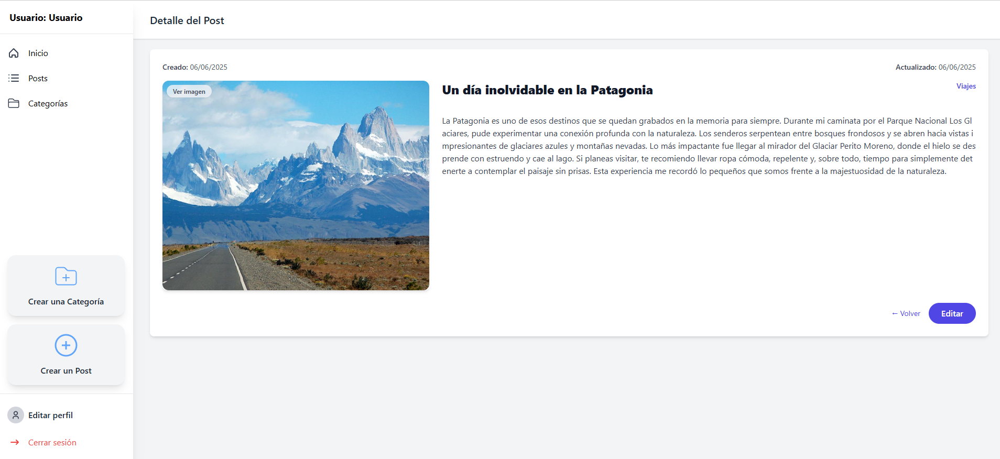
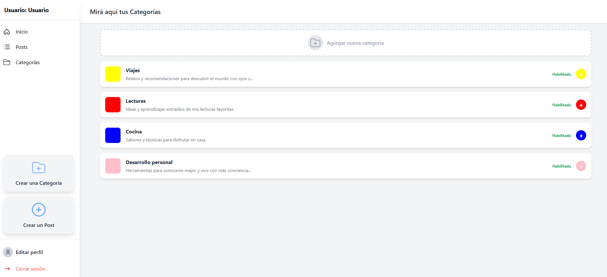
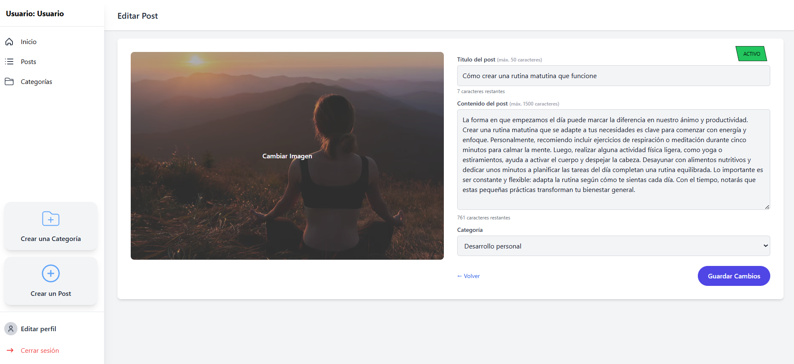

<p align="center">
  
</p>

<h2 align="center"><strong>Tecnicatura Universitaria en Desarrollo Web</strong></h2>
<h3 align="center">Facultad de Informática – Universidad Nacional del Comahue</h3>
<h4 align="center"><i>Programación Web Avanzada</i></h4>

<br>

<p align="center">
  <strong>Integrantes</strong><br>
  Jazmín Loureiro – <i>FAI-4228</i><br>
  Ailen Agustina Flores Montes – <i>FAI-3547</i>
</p>


<p align="center">
  <a href="https://laravel.com" target="_blank">
    
  </a>
</p>

<p align="center">
  <a href="#"></a>
  <a href="#"></a>
  <a href="#"></a>
  <a href="#"></a>
</p>

## 📚 Acerca del Proyecto

**MyBlog** es una aplicación web construida con Laravel que permite a los usuarios autenticados gestionar sus publicaciones y categorías personales. Utiliza Laravel Breeze para el sistema de autenticación y sigue la arquitectura MVC.

## 🚀 Tecnologías Utilizadas

- Laravel 10  
- PHP 8.1+  
- Laravel Breeze  
- Blade (motor de plantillas)  
- Tailwind CSS  
- Vite  
- MySQL  

## ⚙️ Instalación del Proyecto

### 🧰 Requisitos Previos

- **PHP 8.1 o superior**
- **Composer** (https://getcomposer.org/)
- **Node.js y npm** (https://nodejs.org/)
- **MySQL** o motor compatible

### 🛠️ Pasos para instalar

```bash
# Clonar el repositorio
git clone https://github.com/Jazmin-Loureiro/Laravel-tp1 myblog
cd myblog

# Instalar dependencias de PHP
composer install

# Instalar dependencias de frontend y compilar assets
npm install
npm run dev

# Copiar archivo de entorno y generar clave
cp .env.example .env
php artisan key:generate

# Configurar base de datos en .env
# DB_DATABASE=myblog
# DB_USERNAME=usuario
# DB_PASSWORD=contraseña

# Ejecutar migraciones
php artisan migrate

# Si por alguna razón las imágenes no se muestran, intenta regenerar el enlace simbólico
rmdir public\storage
php artisan storage:link

```

### ✅ Acceder a la aplicación

```bash
php artisan serve
```

Ir a [http://localhost:8000](http://localhost:8000)

## 🔐 Autenticación con Laravel Breeze

El sistema de autenticación fue generado con:

```bash
composer require laravel/breeze --dev
php artisan breeze:install
npm install && npm run dev
php artisan migrate
```

Esto genera rutas, controladores y vistas para login, registro y manejo de sesiones.

## 🧩 Estructura del Proyecto

- `app/Http/Controllers/` → Controladores (`HomeController`, `PostController`, etc.)
- `app/Models/` → Modelos (`User`, `Category`, `Post`)
- `resources/views/` → Vistas Blade organizadas en carpetas
- `routes/web.php` → Definición de rutas
- `database/migrations/` → Migraciones de tablas

## ✨ Funcionalidades

- Registro e inicio de sesión de usuarios
- CRUD de categorías (personales por usuario)
- CRUD de publicaciones con imágenes
- Panel de inicio con estadísticas y últimos contenidos
- Middleware `auth` para proteger rutas privadas

## 🖼️ Capturas de Pantalla

### Página de Login


### Página de Inicio


### Detalles 


### Categorias 


### Editar Post 



